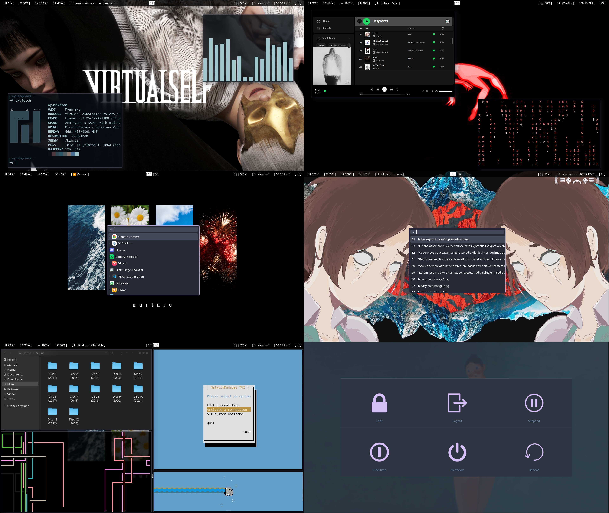

# hyprland-dotfiles

My dotfiles for Hyprland

## Packages

```
WM: Hyprland
Terminal: foot
Bar: waybar
Launcher: wofi
File Manager: Nautilus 
```

## Screenshots



## Dependencies

- [hyprland](https://github.com/vaxerski/hyprland) - Wayland Compositor/WM
- [waybar](https://github.com/Alexays/Waybar) - Bar
- [wofi](https://hg.sr.ht/~scoopta/wofi) - Launcher menu
- [swww](https://github.com/Horus645/swww) - Wallpaper daemon
- [wlogout](https://github.com/ArtsyMacaw/wlogout) - Logout menu
- [foot](https://codeberg.org/dnkl/foot), [kitty](https://github.com/kovidgoyal/kitty) - Terminal emulators
- [grimblast](https://github.com/hyprwm/contrib) - Screenshot tool
- [wl-clipboard](https://github.com/bugaevc/wl-clipboard), [cliphist](https://github.com/sentriz/cliphist): Clipboard tools
- [libsixel](https://github.com/saitoha/libsixel) - View images in terminal
- [nautilus](https://github.com/GNOME/nautilus) - GUI file manager
- [playerctl](https://github.com/altdesktop/playerctl) - Mpris controller
- [networkmanager](https://gitlab.freedesktop.org/NetworkManager/NetworkManager) - Network Manager
- [brightnessctl](https://github.com/Hummer12007/brightnessctl) - Backlight manager
- [wofi-emoji](https://github.com/Zeioth/wofi-emoji) - Emoji selector
- [amixer](https://man.archlinux.org/man/amixer.1.en) - Audio mixer
- [pywal](https://github.com/dylanaraps/pywal) - Color palette generator

## Keybinds

- `SUPER + LEFTMOUSE` - Drag to move windows
- `SUPER + RIGHTMOUSE` - Drag to resize windows
- `SUPER + Q` - Open Terminal (foot)
- `SUPER + (1-9)` - Switch to Workspace (1-9)
- `SUPER + SHIFT + (1-9)` - Move active window to Workspace (1-9)
- `SUPER + SCROLLWHEEL` - Move to Previous/Next Workspace
- `SUPER + R` - Open Application Launcher (wofi)
- `SUPER + C` - Kill current window
- `SUPER + V` - Toggle Tiling/Floating Window
- `SUPER + M` - Execute wlogout
- `SUPER + E` - Open Nautilus
- `SUPER + SPACE` - Open Clipboard
- `SUPER + V` - Toggle Tiling/Floating Window
- `SUPER + SHIFT + S` - Screenshot
- `SUPER + . (period)` - Open Emoji selector
- `SUPER + backtick` - Change wallpaper and terminal color palette
- `SUPER + G` - Enable Group (Window Stacking) - drag and drop a window to stack
- `SUPER + TAB` - Change the active window within a group
- `SUPER + L` - Lock a group
- `SUPER + -` - Move a window out of a group
- `SUPER + S` - Swap active window between monitors

## Tips

- To enable wofi emoji menu follow [this](https://github.com/Zeioth/wofi-emoji).
- To change background and terminal color palette on a certain keybind use `scripts/changewall.sh`
